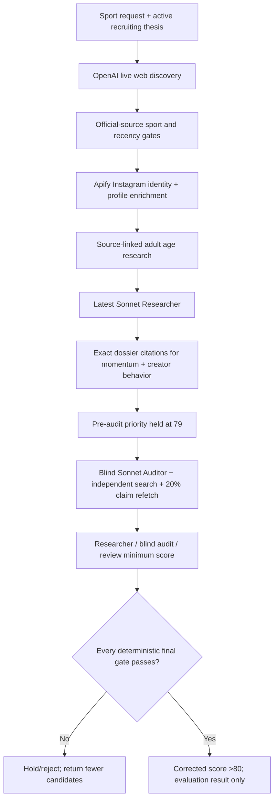

# OnlyFans Athlete Research V2 — Claude Handoff

**Checkpoint date:** 2026-08-12  
**Repository:** `/Users/zacharyvanheyningen/Projects/primechamps`  
**GitHub:** `peakoffer/PrimeChamps`  
**Local branch:** `codex/research-engine-quality-loop`  
**Production branch:** `main`  
**Production:** <https://crm.prime-champs.com>  
**Supabase project:** `rmxuwyxpoazsuqvdadlo`  
**Vercel project/team:** `prj_pdN1qDaRwbTXn9pS3AwAm1vg1faV` / `team_YLzJibaLdsmxiYeAz5yHM2J9`

## Start here

Continue the existing objective; do not replace it with a smaller proxy:

> Build and validate a production-ready, evaluation-only OnlyFans athlete research agent that returns up to 10 genuinely strong candidates per requested sport without padding results or inflating scores. A candidate may score above 80 only after verified identity, corroborated 21+ eligibility, source-backed athletic momentum and creator potential, realistic commercial achievability, and an independent quality audit. Use the latest Sonnet model for scoring, bounded API and token budgets, replayable checkpoints, development and locked held-out benchmarks, and iterative audit-driven improvements. Production readiness requires 100% identity and age-gate accuracy for finalists, zero unsupported material claims, at least 90% held-out precision for candidates scoring 80+, at least 90% audit pass accuracy, and absolutely no outreach or live pipeline promotion during testing. Returning fewer than 10 candidates is correct whenever the available evidence does not support 10 qualified results.

The goal is **not complete**. The production gates are substantially stronger, but the enriched historical benchmark and required held-out proof are still missing.

## Non-negotiable product intent

- Research is the highest-priority CRM capability.
- Optimize for emerging/upcoming athletes with current momentum, a meaningful direct audience, concrete creator behavior, and realistic accessibility—not famous veterans or old Olympic résumés.
- The current recruiting channel is OnlyFans. Never infer willingness to create adult content from appearance, clothing, identity, sexuality, or stereotypes.
- Never pad a run to ten. Zero or fewer than ten is correct when the evidence is insufficient.
- Latest Sonnet is the scoring/audit model policy. Do not pin an older release after a newer compatible Sonnet is available.
- No outreach, DMs, comments, drafts, email, notifications, or live pipeline promotion during testing.
- Be conservative with paid API calls. Diagnose a failed checkpoint before rerunning it.

## Authoritative historical labels

Dylan's 100-row workbook is the sole commercial ground truth for the core benchmark:

| Historical outcome | Count | Ground-truth class |
|---|---:|---|
| Signed | 41 | Positive |
| Approved but Did Not Sign | 3 | Positive |
| Rejected | 23 | Negative |
| Stalled | 33 | Negative |
| **Total** | **100** | **44 positive / 56 negative** |

Do not perform another subjective blind-label exercise on these records. Do not let an older seed label override Dylan's outcome. The historical outcome is revealed only after model predictions are locked.

Current source workbook:

`/Users/zacharyvanheyningen/Library/Messages/Attachments/0c/12/CFBA99F0-A4B3-4AD6-A4B4-EA3D65C540A7/OnlyFans_Athlete_Historical_Benchmark.xlsx`

The original workbook has the 100 outcomes and evidence index but lacks enough historical social/audience evidence. Zac has been given an expanded prompt for Dylan's Gmail-connected chat. The pending return must preserve the 100 rows and add pre-decision sport, handles, follower/engagement data, creator behavior, athletic momentum, 21+ hints, commercial-access facts, and exact email/attachment provenance. Missing data must remain `Not available`; current or post-decision data must not be substituted.

## Current production checkpoint

- Deployed production-code checkpoint: `176365551120fbfab3357ae5618da201b8e62086` — `Require source-backed research finalists`. Later documentation-only commits do not change this code checkpoint.
- Vercel production deployment: `dpl_39DMEHCxpkkBkpS5RvCPrhMmfxEb` — `READY`.
- Production alias is attached to `crm.prime-champs.com`; `/` returns a 307 to login and `/login` returns 200.
- Active prompt version: `research-v8-source-backed-finalist-gates`.
- The 2026-08-12 smoke run resolved `claude-sonnet-5` dynamically through Anthropic's model catalog.
- Typecheck passes, focused lint has zero errors, and all 74 unit tests pass.
- Full repository lint has zero errors and 53 pre-existing warnings unrelated to this checkpoint.
- Local Turbopack production builds can hang after compilation on this machine. Vercel's exact Git production build is the authoritative build proof and is green.

## Completed bounded smoke run

- Research log ID: `6c898a22-c961-4612-8c5b-7dd14517c2a3`
- Workflow run ID: `wrun_01KZW158HR29B55RAKXDFJWEGQ`
- Sport/profile: volleyball / `smoke`
- Hard budget: one discovery wave, eight requested discovery candidates, no more than six Instagram enrichments, three requested finalists, no more than three audits.
- Mode: `is_evaluation = true`; no live-pipeline writes are allowed.
- Final status: `completed` at `2026-08-12 22:28:22.648+00`, with no workflow error.
- Final funnel: 44 sourced, six admitted discoveries, four Instagram-enriched and scored candidates, zero qualified finalists, and zero returned finalists. `quality_passed` is false.
- Scored candidates: Devon Newberry 79, Madisen Skinner 77, Mimi Colyer 77, and Anna DeBeer 68. No Researcher proposal exceeded 80, so triggering zero paid blind audits was expected and correct.
- Anthropic usage was 21,887 Researcher input tokens and 3,620 output tokens across four scored candidates. Audit token usage was zero. Apify recorded four Instagram profiles, one Instagram search run, and one batched age run. The run stored provider operations but not a reliable all-in dollar total; do not invent one.
- Isolation was proven after completion: zero live athletes created, zero candidates missing the test-data flag, and zero completion notifications.
- Interpretation: the engine failed closed instead of manufacturing finalists. Safety is working. Candidate sourcing and evidence coverage still need improvement before the system can reliably produce genuine 80+ opportunities.

Read-only status query:

```sql
select
  status, phase, heartbeat_at, completed_at, error_message, stats,
  jsonb_array_length(coalesce(raw_results, '[]'::jsonb)) as raw_count,
  jsonb_array_length(coalesce(scoring_details, '[]'::jsonb)) as checkpoint_count,
  jsonb_array_length(coalesce(final_results, '[]'::jsonb)) as finalist_count,
  provider_costs
from public.research_logs
where id = '6c898a22-c961-4612-8c5b-7dd14517c2a3';
```

Isolation proof queries (already run successfully; retain for reproducibility):

```sql
select count(*) as live_athletes_created
from public.athletes
where source_research_log_id = '6c898a22-c961-4612-8c5b-7dd14517c2a3';

select count(*) as candidates_not_marked_test
from public.research_candidates
where research_log_id = '6c898a22-c961-4612-8c5b-7dd14517c2a3'
  and is_test_data is not true;

select count(*) as completion_notifications
from public.activity_notifications
where metadata->>'runId' = '6c898a22-c961-4612-8c5b-7dd14517c2a3';
```

All three counts were zero. For later runs, if a workflow errors, use its durable phase/raw/scoring checkpoint and the existing resume/fork functions; do not buy discovery and enrichment again blindly.

## How the live evaluation agent works



Key behavior:

1. Discovery uses live, cited sources and sport-specific strategies.
2. Identity requires an attributable personal Instagram profile and at least 70 confidence.
3. Audience data comes from the verified Apify profile, not an LLM estimate.
4. The Researcher must return exact URLs and matching excerpts for current athletic momentum and creator behavior.
5. The code validates those citations against the frozen dossier text.
6. A meaningful audience requires the active follower minimum or a bounded exception: at least half that minimum (never below 10,000) plus at least 4% engagement.
7. A Researcher proposal above 80 is stored/displayed as 79 until independent audit.
8. The blind Auditor independently checks identity, 21+, momentum, audience, creator behavior, source support, contradictions, and complete access/representation/economics constraints.
9. At least 20% of non-social material sources are re-fetched. Any unsupported sample fails closed.
10. Final dimensions are the minimum of the Researcher, blind Auditor, and review correction. Audit can only hold or lower a score.
11. Objective guardrails apply after correction, so veteran/weak-objective profiles cannot be raised by audit.
12. Evaluation mode writes research evidence/scores/audits only. It exits before athlete insertion and suppresses completion notifications.

## Final >80 gate in code

Every condition is mandatory:

- Corrected priority `> 80`.
- OnlyFans fit `>= 80`.
- Commercial achievability `>= 70`.
- Research confidence `>= 80`.
- Identity confirmed.
- Source-verified age `>= 21` and independent Auditor eligibility pass.
- Source-backed current athletic momentum and independent Auditor pass.
- Meaningful measured audience and independent Auditor pass.
- Source-backed creator behavior and independent Auditor pass.
- Commercial constraints complete.
- Material claims verified with zero unsupported claims.
- Audit verdict is `pass` or evidence-corrected, with zero critical gaps.
- Public, active Instagram; strong objective fit; no veteran profile.

Primary implementation files:

- `dashboard/src/app/api/research/run/workflow.ts` — discovery through evaluation-only persistence.
- `dashboard/src/lib/research/v2-scoring.ts` — score math, pre-audit hold, audit ceilings, citation matching, audience gate, final gate.
- `dashboard/src/lib/research/scoring.ts` — objective guardrails and prompt version.
- `dashboard/src/lib/research/evaluation-runs.ts` — bounded evaluation launch/resume/forks.
- `dashboard/src/lib/research/evaluation-budget.ts` — smoke/development/release hard budgets.
- `dashboard/src/lib/research/benchmark-runner.ts` — historical development/held-out model stages and checkpoints.
- `dashboard/src/lib/research/benchmark-runner-support.ts` — benchmark evidence/finalist gates, leakage controls, metrics, cost accounting.
- `dashboard/src/lib/research/historical-social-snapshot.ts` — strict pre-decision mailbox snapshot validation.
- `dashboard/scripts/import-onlyfans-historical-benchmark.ts` — dry-run/apply importer with required backup.
- `dashboard/tests/research-v2.test.ts` — benchmark, leakage, scoring, audit, and isolation regression suite.
- `docs/research-v2-benchmark-runbook.md` — execution and release rules.

## Model and connector policy

- Production discovery: `OPENAI_RESEARCH_MODEL`, currently defaulting to `gpt-5.6`, using Responses web search.
- Production scoring and blind audit: latest Sonnet resolved from Anthropic's live model catalog; do not allow an old user selection to pin a stale release.
- Historical benchmark: OpenRouter latest structured-output Sonnet is preferred when configured; direct Anthropic is fallback. Exact provider/model/release/price is stored per run.
- Identity and Instagram metrics: Apify exact-name search plus separate profile verification.
- Perplexity is an optional degraded fallback, not the primary discovery path.
- Modash is intentionally deferred; the $10k-$16.2k annual API cost is unjustified without a measured coverage gap.

Required environment-variable names are documented in the app/Vercel configuration. Never print, paste into chat, log, or commit their values. Important names include `OPENAI_API_KEY`, `APIFY_API_KEY`, `ANTHROPIC_API_KEY`, `OPENROUTER_API_KEY`, Supabase server credentials, and `RESEARCH_EVALUATION_SECRET` or `CRON_SECRET`.

## Historical benchmark status

- Dylan source truth: 100/100 outcomes, 44 positive and 56 negative.
- Current positive readiness audit before the pending workbook: identity 33/44; age 16/44; momentum 31/44; audience 4/44; creator 25/44; all core gates 3/44.
- Current negative readiness: identity 38/56; age 5/56; momentum 30/56; audience 1/56; creator 20/56; all core gates 0/56.
- Audience-at-decision is the largest data gap.
- The original revealed cohort `onlyfans-athlete-v1-2026-08-12-149b1a6e` must never be reused as held-out.
- Original held-out run `8ddf4794-9107-4d97-ade1-e1b027b9b6f9` completed 16/16 for about $0.813. It safely returned no >80 finalists but achieved only 50% audit decisions, so it did not prove production readiness.
- A fresh held-out cohort must be locked only after development calibration is frozen.

## Exact next sequence

### 1. Preserve the completed smoke baseline

- This is complete. Do not rerun it merely to obtain a non-zero result.
- Use log `6c898a22-c961-4612-8c5b-7dd14517c2a3` as the fail-closed smoke baseline.
- No candidate exceeded 80, no blind audit was eligible, and the three isolation counts were zero.
- The next paid work should follow the enriched-workbook import and a deliberate development-benchmark plan.

### 2. Ingest Dylan's enriched workbook when Zac uploads it

- Treat the returned workbook as untrusted input and inspect it with the spreadsheet tooling.
- Verify exactly 100 rows, stable names/order, and outcome counts `41/3/23/33` before any database write.
- Verify every populated enrichment field has a pre-decision source date, email subject, document reference, and supporting evidence-detail row.
- Quarantine post-decision/current/ambiguous records rather than repairing them with guesses.
- Convert the workbook deterministically to the importer's JSON contract; add a converter or extend the importer if the returned column layout requires it. Do not manually rewrite 100 rows.
- Run the importer without `--apply` first. Review counts and conflicts.
- Apply only with an explicit pre-import backup path. Re-query the stored dataset after import.

### 3. Build the development benchmark

- Recompute readiness from actual evidence, not provider-run counts.
- Keep source-of-truth labels hidden from prompts.
- Assign evidence-ready records automatically and deterministically to development vs fresh held-out.
- Run only development cases first under a bounded dollar/token budget.
- Audit false positives, false negatives, unsupported claims, identity errors, age errors, criteria drift, and Auditor misses.
- Change one major variable at a time and retain only measured improvements.

### 4. Freeze and prove release

- Freeze prompt, rubric, evidence policy, model route, weighting, and development decision before revealing the held-out split.
- Run the fresh locked held-out cohort once.
- Production readiness requires non-zero denominators and all of:
  - 100% finalist identity accuracy;
  - 100% finalist 21+ accuracy;
  - zero unsupported material finalist claims;
  - at least 90% precision among predictions above 80;
  - at least 90% audit pass/catch accuracy;
  - complete point-in-time compliance.
- Then run evaluation-only sport requests across different sport archetypes. Returning fewer than ten remains correct.

## Verification commands

Run from `dashboard/`:

```bash
npm run typecheck
npm run test:unit
npx eslint src/app/api/research/run/workflow.ts src/lib/research/scoring.ts src/lib/research/v2-scoring.ts tests/research-v2.test.ts
```

Before changing files:

```bash
cd /Users/zacharyvanheyningen/Projects/primechamps
git status --short --branch
git log --oneline -12
```

The local branch and `main` pointed to commit `1763655` at this checkpoint, and the worktree was clean before this handoff documentation edit.

## Known traps

- Do not call an internally stored outcome, fit explanation, or post-decision email public research evidence.
- Do not reuse the revealed held-out cohort.
- Do not use a provider run or profile scrape as proof that audience/creator evidence exists; inspect the actual normalized claims.
- Do not accept model-generated creator strings without exact URL/excerpt matching.
- Do not let the review stage raise either the Researcher or blind-Auditor score.
- Do not treat a 79 pre-audit hold as a weak score; inspect `researcher_proposed_score` and audit eligibility.
- Do not run development/release profiles in parallel until the smoke path is understood.
- Do not retry discovery/enrichment when a durable fork/resume checkpoint can be reused.
- Do not mark the project production-ready because tests and deployment are green; the locked held-out acceptance thresholds remain unproven.

## Definition of the next clean stopping point

The next agent should aim to finish with:

1. Dylan's enriched workbook validated and imported with backup.
2. A sufficiently evidence-ready development cohort.
3. Development metrics and failure classes recorded after at least one controlled iteration.
4. No held-out reveal until the configuration is frozen.

The current Codex stopping point is intentionally one step earlier and clean: production code is deployed, the smoke test is complete and isolated, the handoff is documented, no live outreach state was touched, and no additional paid run should start until the pending workbook is available.
