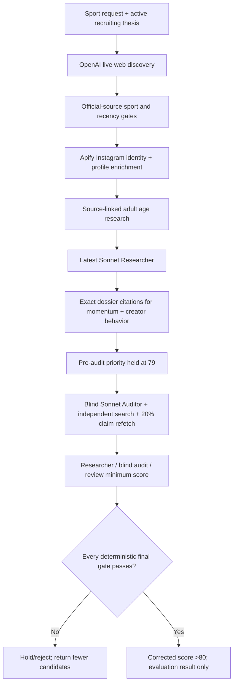

# OnlyFans Athlete Research V2 — Claude Handoff

**Checkpoint date:** 2026-08-13
**Repository:** `/Users/zacharyvanheyningen/Projects/primechamps`  
**GitHub:** `peakoffer/PrimeChamps`  
**Local branch:** `codex/research-engine-quality-loop`  
**Production branch:** `main`  
**Production:** <https://crm.prime-champs.com>  
**Supabase project:** `rmxuwyxpoazsuqvdadlo`  
**Vercel project/team:** `prj_pdN1qDaRwbTXn9pS3AwAm1vg1faV` / `team_YLzJibaLdsmxiYeAz5yHM2J9`

## Start here

Continue the existing objective; do not replace it with a smaller proxy:

> Build and validate a production-ready, evaluation-only OnlyFans athlete research agent that returns up to 10 genuinely strong candidates per requested sport without padding results or inflating scores. A candidate may score above 80 only after verified identity, corroborated 21+ eligibility, source-backed athletic momentum and creator potential, realistic commercial achievability, and an independent quality audit. Use the latest Sonnet model for scoring, bounded API and token budgets, replayable checkpoints, development and locked held-out benchmarks, and iterative audit-driven improvements. Production readiness requires 100% identity and age-gate accuracy for finalists, zero unsupported material claims, at least 90% held-out precision for candidates scoring 80+, at least 90% audit pass accuracy, and absolutely no outreach or live pipeline promotion during testing. Returning fewer than 10 candidates is correct whenever the available evidence does not support 10 qualified results.

The goal is **not complete**. The production gates are substantially stronger and Dylan's enriched benchmark is safely imported, but a fresh evidence-ready cohort, development calibration, and locked held-out proof are still missing.

## Non-negotiable product intent

- Research is the highest-priority CRM capability.
- Optimize for emerging/upcoming athletes with current momentum, a meaningful direct audience, concrete creator behavior, and realistic accessibility—not famous veterans or old Olympic résumés.
- The current recruiting channel is OnlyFans. Never infer willingness to create adult content from appearance, clothing, identity, sexuality, or stereotypes.
- Never pad a run to ten. Zero or fewer than ten is correct when the evidence is insufficient.
- Latest Sonnet is the scoring/audit model policy. Do not pin an older release after a newer compatible Sonnet is available.
- No outreach, DMs, comments, drafts, email, notifications, or live pipeline promotion during testing.
- Be conservative with paid API calls. Diagnose a failed checkpoint before rerunning it.

## Authoritative historical labels

Dylan's 100-row workbook is the sole commercial ground truth for the core benchmark:

| Historical outcome | Count | Ground-truth class |
|---|---:|---|
| Signed | 41 | Positive |
| Approved but Did Not Sign | 3 | Positive |
| Rejected | 23 | Negative |
| Stalled | 33 | Negative |
| **Total** | **100** | **44 positive / 56 negative** |

Do not perform another subjective blind-label exercise on these records. Do not let an older seed label override Dylan's outcome. The historical outcome is revealed only after model predictions are locked.

Current enriched source workbook:

`/Users/zacharyvanheyningen/Library/Messages/Attachments/be/14/E5D20F7E-E020-4955-9E02-C247E30452A2/OnlyFans_Athlete_Historical_Benchmark_Enriched.xlsx`

This workbook was validated and imported on 2026-08-12. The original workbook remains at `/Users/zacharyvanheyningen/Library/Messages/Attachments/0c/12/CFBA99F0-A4B3-4AD6-A4B4-EA3D65C540A7/OnlyFans_Athlete_Historical_Benchmark.xlsx` and is the locked comparison source. All 100 original benchmark rows and all 100 Evidence Index rows match it exactly. Do not replace `Not available` values with guesses or current/post-decision data.

Import code checkpoint: `3e6b90d` — `Import enriched historical benchmark evidence`.

## Current production checkpoint

- Previously verified production-gate checkpoint: `176365551120fbfab3357ae5618da201b8e62086` — `Require source-backed research finalists`.
- The Social Blade pilot adapter landed at `37bff04`, split-safe checkpoints at `d4f6185`, and archive retry throttling at `3efd01b`. Confirm the current `main` Vercel deployment is `READY` before resuming paid work; do not assume an older hash in this handoff is still the tip.
- Production alias is attached to `crm.prime-champs.com`; `/` returns a 307 to login and `/login` returns 200.
- Active prompt version: `research-v10-corroborated-identity-and-21-plus-gates`.
- The 2026-08-12 smoke run resolved `claude-sonnet-5` dynamically through Anthropic's model catalog.
- Typecheck passes, focused lint has zero errors, and all 82 unit tests pass. The benchmark page retains one pre-existing React effect warning.
- Full repository lint has zero errors and 53 pre-existing warnings unrelated to this checkpoint.
- Local Turbopack production builds can hang after compilation on this machine. Vercel's exact Git production build is the authoritative build proof and is green.

## Completed bounded smoke run

- Research log ID: `6c898a22-c961-4612-8c5b-7dd14517c2a3`
- Workflow run ID: `wrun_01KZW158HR29B55RAKXDFJWEGQ`
- Sport/profile: volleyball / `smoke`
- Hard budget: one discovery wave, eight requested discovery candidates, no more than six Instagram enrichments, three requested finalists, no more than three audits.
- Mode: `is_evaluation = true`; no live-pipeline writes are allowed.
- Final status: `completed` at `2026-08-12 22:28:22.648+00`, with no workflow error.
- Final funnel: 44 sourced, six admitted discoveries, four Instagram-enriched and scored candidates, zero qualified finalists, and zero returned finalists. `quality_passed` is false.
- Scored candidates: Devon Newberry 79, Madisen Skinner 77, Mimi Colyer 77, and Anna DeBeer 68. No Researcher proposal exceeded 80, so triggering zero paid blind audits was expected and correct.
- Anthropic usage was 21,887 Researcher input tokens and 3,620 output tokens across four scored candidates. Audit token usage was zero. Apify recorded four Instagram profiles, one Instagram search run, and one batched age run. The run stored provider operations but not a reliable all-in dollar total; do not invent one.
- Isolation was proven after completion: zero live athletes created, zero candidates missing the test-data flag, and zero completion notifications.
- Interpretation: the engine failed closed instead of manufacturing finalists. Safety is working. Candidate sourcing and evidence coverage still need improvement before the system can reliably produce genuine 80+ opportunities.

Read-only status query:

```sql
select
  status, phase, heartbeat_at, completed_at, error_message, stats,
  jsonb_array_length(coalesce(raw_results, '[]'::jsonb)) as raw_count,
  jsonb_array_length(coalesce(scoring_details, '[]'::jsonb)) as checkpoint_count,
  jsonb_array_length(coalesce(final_results, '[]'::jsonb)) as finalist_count,
  provider_costs
from public.research_logs
where id = '6c898a22-c961-4612-8c5b-7dd14517c2a3';
```

Isolation proof queries (already run successfully; retain for reproducibility):

```sql
select count(*) as live_athletes_created
from public.athletes
where source_research_log_id = '6c898a22-c961-4612-8c5b-7dd14517c2a3';

select count(*) as candidates_not_marked_test
from public.research_candidates
where research_log_id = '6c898a22-c961-4612-8c5b-7dd14517c2a3'
  and is_test_data is not true;

select count(*) as completion_notifications
from public.activity_notifications
where metadata->>'runId' = '6c898a22-c961-4612-8c5b-7dd14517c2a3';
```

All three counts were zero. For later runs, if a workflow errors, use its durable phase/raw/scoring checkpoint and the existing resume/fork functions; do not buy discovery and enrichment again blindly.

## How the live evaluation agent works



Key behavior:

1. Discovery uses live, cited sources and sport-specific strategies.
2. Identity requires an attributable personal Instagram profile and at least 70 confidence.
3. Audience data comes from the verified Apify profile, not an LLM estimate.
4. The Researcher must return exact URLs and matching excerpts for current athletic momentum and creator behavior.
5. The code validates those citations against the frozen dossier text.
6. A meaningful audience requires the active follower minimum or a bounded exception: at least half that minimum (never below 10,000) plus at least 4% engagement.
7. A Researcher proposal above 80 is stored/displayed as 79 until independent audit.
8. The blind Auditor independently checks identity, 21+, momentum, audience, creator behavior, source support, contradictions, and complete access/representation/economics constraints.
9. At least 20% of non-social material sources are re-fetched. Any unsupported sample fails closed.
10. Final dimensions are the minimum of the Researcher, blind Auditor, and review correction. Audit can only hold or lower a score.
11. Objective guardrails apply after correction, so veteran/weak-objective profiles cannot be raised by audit.
12. Evaluation mode writes research evidence/scores/audits only. It exits before athlete insertion and suppresses completion notifications.

## Final >80 gate in code

Every condition is mandatory:

- Corrected priority `> 80`.
- OnlyFans fit `>= 80`.
- Commercial achievability `>= 70`.
- Research confidence `>= 80`.
- Identity confirmed.
- Source-verified age `>= 21` and independent Auditor eligibility pass.
- Source-backed current athletic momentum and independent Auditor pass.
- Meaningful measured audience and independent Auditor pass.
- Source-backed creator behavior and independent Auditor pass.
- Commercial constraints complete.
- Material claims verified with zero unsupported claims.
- Audit verdict is `pass` or evidence-corrected, with zero critical gaps.
- Public, active Instagram; strong objective fit; no veteran profile.

Primary implementation files:

- `dashboard/src/app/api/research/run/workflow.ts` — discovery through evaluation-only persistence.
- `dashboard/src/lib/research/v2-scoring.ts` — score math, pre-audit hold, audit ceilings, citation matching, audience gate, final gate.
- `dashboard/src/lib/research/scoring.ts` — objective guardrails and prompt version.
- `dashboard/src/lib/research/evaluation-runs.ts` — bounded evaluation launch/resume/forks.
- `dashboard/src/lib/research/evaluation-budget.ts` — smoke/development/release hard budgets.
- `dashboard/src/lib/research/benchmark-runner.ts` — historical development/held-out model stages and checkpoints.
- `dashboard/src/lib/research/benchmark-runner-support.ts` — benchmark evidence/finalist gates, leakage controls, metrics, cost accounting.
- `dashboard/src/lib/research/historical-social-snapshot.ts` — strict pre-decision mailbox snapshot validation.
- `dashboard/src/lib/research/historical-instagram-history.ts` — exact-handle, pre-cutoff reuse of already-paid Apify profile snapshots.
- `dashboard/src/lib/research/social-blade-history.ts` — exact-handle Social Blade tier selection and cutoff-safe daily metric normalization.
- `dashboard/src/app/api/research/golden-records/social-blade-history/route.ts` — owner-only five-profile historical audience pilot with an explicit credit ceiling.
- `dashboard/src/lib/research/historical-workbook-converter.ts` — deterministic extracted-workbook conversion and locked-source comparison.
- `dashboard/scripts/convert-onlyfans-historical-workbook-extraction.ts` — converts spreadsheet-tool extraction JSON into the importer's 100-record contract.
- `dashboard/scripts/import-onlyfans-historical-benchmark.ts` — dry-run/apply importer with required backup.
- `dashboard/scripts/audit-onlyfans-historical-benchmark-readiness.ts` — read-only evidence/readiness audit over the stored 100-record dataset.
- `dashboard/tests/research-v2.test.ts` — benchmark, leakage, scoring, audit, and isolation regression suite.
- `docs/research-v2-benchmark-runbook.md` — execution and release rules.

## Model and connector policy

- Production discovery: `OPENAI_RESEARCH_MODEL`, currently defaulting to `gpt-5.6`, using Responses web search.
- Production scoring and blind audit: latest Sonnet resolved from Anthropic's live model catalog; do not allow an old user selection to pin a stale release.
- Historical benchmark: OpenRouter latest structured-output Sonnet is preferred when configured; direct Anthropic is fallback. Exact provider/model/release/price is stored per run.
- Identity and Instagram metrics: Apify exact-name search plus separate profile verification.
- Perplexity is an optional degraded fallback, not the primary discovery path.
- Modash is intentionally deferred; the $10k-$16.2k annual API cost is unjustified. Social Blade is the bounded historical-audience recovery lane: its official Business API exposes Instagram daily follower/post/engagement history, with one-year `extended` requests costing at most two credits per profile. The 14 known positive handles all have cutoffs within one year as of 2026-08-13.

Required environment-variable names are documented in the app/Vercel configuration. Never print, paste into chat, log, or commit their values. Important names include `OPENAI_API_KEY`, `APIFY_API_KEY`, `ANTHROPIC_API_KEY`, `OPENROUTER_API_KEY`, `SOCIAL_BLADE_CLIENT_ID`, `SOCIAL_BLADE_TOKEN`, Supabase server credentials, and `RESEARCH_EVALUATION_SECRET` or `CRON_SECRET`.

## Historical benchmark status

- Dylan source truth: 100/100 outcomes, 44 positive and 56 negative.
- Enriched workbook validation: zero locked-source differences, zero duplicate names/refs, 748 detail ledger rows covering all 100 athletes, zero post-cutoff rows, and 420 usable claim rows across 76 athletes. The other 24 correctly contain only `Not available` audit notes.
- Controlled import: 100 updates, zero creates, zero conflicts, 420 deterministic detail sources and 420 detail claims. All 420 sources are cutoff-safe, 406 claims are scoring-eligible, 12 medium-confidence claims remain excluded, one mailbox age hint remains excluded, and one outcome-like commercial excerpt remains excluded. Zero eligible outcome-like claims and zero future claims were found after import.
- The corrected audit reads evidence claims in bounded batches instead of silently stopping at Supabase's default 1,000-row response cap. After archive-signal attribution hardening, it finds 28 total evidence-ready records.
- Existing assignments are 16 development records, 16 already-revealed held-out records, and 68 fresh excluded records. Of the fresh excluded pool, zero positives and all 16 required negatives are evidence-ready.
- The fresh cohort route requires 16 evidence-ready records per label before it can freeze eight fresh held-out examples per label. The immediate gap is therefore 16 excluded positives and zero excluded negatives.
- Six records still have unresolved sport. Audience-at-decision and independent age/identity corroboration are the largest gaps.
- One capped excluded-positive recovery run (`81896c04-9f22-4c30-ac68-4845abafa6ab`) spent $0.061 on a single saved Google discovery batch, processed seven records before the Internet Archive rate-limited, and added 27 safe claims. It recovered identity/momentum/creator details but zero audience claims. A zero-new-spend replay of the remaining three records on 2026-08-13 also hit the Wayback rate limit before processing any record. The workflow now reuses this paid checkpoint with two bounded free fallbacks: the latest Wikipedia article revision at or before the cutoff through MediaWiki's revisions API, and at most two pre-cutoff Common Crawl collections with one indexed WARC byte range per candidate. Both use the same deterministic extractor and provider-specific provenance. A Wikipedia revision counts as one independent source. Wayback cooldown is retained as telemetry but does not block these fallbacks.
- Lola Gallardo recovery run `2ec96854-ebc2-40a5-af76-b6cdcabbdd57` reused saved discovery with zero new Apify spend and zero scoring tokens. It cleared every blocker with eight independent sources and 30 run-safe claims after narrowly supporting the actual `Football / soccer` label and ESPN's archived `Lola Gallardo [she/her], 28, has...` syntax.
- The final three-record negative recovery run `7f507de9-7d8e-47ff-870b-9a37629bb64e` processed Murat Kazgan, Christen Press, and Sadio Doumbia for $0.0185, zero scoring tokens, and zero live writes. All three became evidence-ready, closing the required fresh negative cohort at 16.
- A subsequent material-claim audit found 95 archived momentum, audience, or commercial claims whose pages mentioned the athlete but did not explicitly attribute the claimed signal to them. Those claims were retained for provenance but atomically marked unsupported and ineligible via an idempotent audit; zero sources were deleted and zero live/outreach tables were touched. The benchmark gates now also refuse generic candidate evidence unless its signal is tied to the named athlete in the same sentence or an immediately following pronoun sentence. The corrected global audit is 28 ready cases, 1,194 safe claims, 907 sources, 100/100 point-in-time compliance, and fresh excluded readiness of `0 fit / 16 not-fit`. Lola now correctly fails only the historical-audience gate.
- Existing Apify Instagram history was then scanned without starting new Actor runs. Fourteen positive records had exact, pre-cutoff handle evidence, but zero matching stored profile snapshots existed before their cutoffs. Do not reinterpret current or post-cutoff scrapes as historical evidence.
- Free audience-history alternatives were exhausted without a usable snapshot. Exact Social Blade and Instagram profile URLs for five priority handles had no near-cutoff Common Crawl capture; Wayback had none except one 2016 Instagram page that was far too stale. The community Actor `gordian/instagram-profile-history` was then tested behind an owner-only one-profile/$0.02 ceiling. Its diagnostic Carlos Gimeno run `pSDkS9ZAuBh9nNglv` returned no account and zero history rows at $0.0000. The experimental route and UI control were removed rather than leaving dead product surface.
- Social Blade is the next measured pilot. All 14 known positive cutoffs fall between 2025-10-07 and 2026-08-05, so the official API needs at most 28 credits for all records; start with five records and a hard ten-credit ceiling, then audit actual match/readiness gain before continuing.
- The original revealed cohort `onlyfans-athlete-v1-2026-08-12-149b1a6e` must never be reused as held-out.
- Original held-out run `8ddf4794-9107-4d97-ade1-e1b027b9b6f9` completed 16/16 for about $0.813. It safely returned no >80 finalists but achieved only 50% audit decisions, so it did not prove production readiness.
- A fresh held-out cohort must be locked only after development calibration is frozen.

## Exact next sequence

### 1. Preserve the completed smoke baseline

- This is complete. Do not rerun it merely to obtain a non-zero result.
- Use log `6c898a22-c961-4612-8c5b-7dd14517c2a3` as the fail-closed smoke baseline.
- No candidate exceeded 80, no blind audit was eligible, and the three isolation counts were zero.
- The next paid work should follow the enriched-workbook import and a deliberate development-benchmark plan.

### 2. Preserve the completed enriched-workbook import

- This is complete. Do not re-import unless a genuinely newer source workbook arrives.
- The two local pre-import backups are under `dashboard/data/backups/` and intentionally ignored by Git because they contain internal data.
- The first apply attempt stopped on the third golden record because the old revealed held-out lock rejected a split reset. It wrote the backup first and no detailed evidence before stopping. The importer was corrected to preserve all existing cohort assignments, passed a second dry-run, and then completed idempotently.
- Database post-proof: 100 golden records, exact `41/3/23/33` outcomes, 420 detail sources, 420 detail claims, zero future claims, zero eligible outcome-like claims, and old `16 development / 16 revealed held-out / 68 excluded` assignments preserved.
- Raw workbook extraction JSON, converted records, and backups live under `dashboard/data/` and are intentionally ignored. Never commit them.

### 3. Recover only the missing fresh-cohort evidence

- Run `npm run audit:historical-benchmark` before and after each recovery batch.
- Work only on excluded, never-evaluated records intended for the next cohort. Do not change or reuse the revealed held-out cohort.
- Reach at least 16 evidence-ready excluded positives and 16 evidence-ready excluded negatives. Current state is `0 positive / 16 negative`, so the only remaining gap is `16 positive / 0 negative`.
- Prioritize positives with an existing historical Instagram handle, creator behavior, and momentum, then recover two-source identity, two-source 21+, and an audience snapshot. Do not spend age-research money on cases that still lack audience/creator viability.
- Use bounded evidence-preparation batches; inspect each batch before the next. Do not run Researcher/Auditor scoring during evidence recovery.
- Do not buy another Google/archive discovery run or another community Apify Actor for the same audience gap: every measured free/cheap path produced zero usable historical audience rows. Replay the saved checkpoint through cutoff-safe MediaWiki/Common Crawl only for non-audience identity, age, momentum, or creator evidence; stop if the readiness audit shows no gain.
- Configure the server-only `SOCIAL_BLADE_CLIENT_ID` and `SOCIAL_BLADE_TOKEN`, then run only the five-profile pilot shown in the Golden benchmark UI. The request must explicitly confirm the exact plan ceiling and can never exceed ten credits. Accept only exact handles and Social Blade daily rows no more than 31 days before the decision cutoff. Audit readiness gain before buying or using further credits.
- A mailbox statement can seed a query but cannot satisfy two-source age. Medium/low identity claims and outcome-like commercial excerpts remain non-scoring.

### 4. Build the development benchmark

- Recompute readiness from actual evidence, not provider-run counts.
- Keep source-of-truth labels hidden from prompts.
- Assign only the fresh 16/16 evidence-ready excluded pool automatically and deterministically to development vs fresh held-out.
- Run only development cases first under a bounded dollar/token budget.
- Audit false positives, false negatives, unsupported claims, identity errors, age errors, criteria drift, and Auditor misses.
- Change one major variable at a time and retain only measured improvements.

### 5. Freeze and prove release

- Freeze prompt, rubric, evidence policy, model route, weighting, and development decision before revealing the held-out split.
- Run the fresh locked held-out cohort once.
- Production readiness requires non-zero denominators and all of:
  - 100% finalist identity accuracy;
  - 100% finalist 21+ accuracy;
  - zero unsupported material finalist claims;
  - at least 90% precision among predictions above 80;
  - at least 90% audit pass/catch accuracy;
  - complete point-in-time compliance.
- Then run evaluation-only sport requests across different sport archetypes. Returning fewer than ten remains correct.

## Verification commands

Run from `dashboard/`:

```bash
npm run typecheck
npm run test:unit
npm run audit:historical-benchmark
npx eslint src/app/api/research/run/workflow.ts src/lib/research/scoring.ts src/lib/research/v2-scoring.ts tests/research-v2.test.ts
```

Before changing files:

```bash
cd /Users/zacharyvanheyningen/Projects/primechamps
git status --short --branch
git log --oneline -12
```

The last fully deployed checkpoint before the Social Blade adapter is `27b3ee7`. Use `git log --oneline -12` for the newest documentation/push commit above it.

## Known traps

- Do not call an internally stored outcome, fit explanation, or post-decision email public research evidence.
- Do not count the 24 `Evidence Availability Notes` rows as evidence; they are audit records explaining that no eligible enrichment was found.
- Do not treat mailbox age evidence as a finalist age source or medium-confidence identity matches as scoring evidence.
- Do not reset a record's old benchmark split during an evidence import. The importer preserves it; a fresh split is created only by the explicit cohort-freeze route.
- Do not reuse the revealed held-out cohort.
- Do not use a provider run or profile scrape as proof that audience/creator evidence exists; inspect the actual normalized claims.
- Social Blade proves metrics for an exact public handle; it does not independently prove that the handle belongs to the named athlete. Never generate an identity claim from Social Blade alone.
- Do not accept model-generated creator strings without exact URL/excerpt matching.
- Do not let the review stage raise either the Researcher or blind-Auditor score.
- Do not treat a 79 pre-audit hold as a weak score; inspect `researcher_proposed_score` and audit eligibility.
- Do not run development/release profiles in parallel until the smoke path is understood.
- Do not retry discovery/enrichment when a durable fork/resume checkpoint can be reused.
- Do not mark the project production-ready because tests and deployment are green; the locked held-out acceptance thresholds remain unproven.

## Definition of the next clean stopping point

The next agent should aim to finish with:

1. At least 16 evidence-ready fresh excluded positives and 16 evidence-ready fresh excluded negatives.
2. A new deterministic cohort with eight per label locked held-out and unrevealed.
3. Development metrics and failure classes recorded after at least one controlled iteration.
4. No held-out reveal until the configuration is frozen.

The current Codex stopping point is intentionally clean: Dylan's workbook is validated/imported, database state is verified, the fail-closed smoke baseline is preserved, no live athletes or outreach were created, and no next paid benchmark run has started. Resume with targeted evidence recovery, not scoring.
