# Prime Champs Research Agent — Process and Cost Map

## Operating rule

Quality gates reduce cost; they do not reduce research quality. The agent reuses current verified evidence first, buys fresh discovery data only when needed, and sends only evidence-complete dossiers to premium models. Speed premiums are disabled for background evaluation work.

```mermaid
flowchart LR
  A["1. Brief + candidate memory\n$0 external"] --> B["2. Live discovery\nOpenAI web search\n$0.30–$0.84"]
  B -->|"exact athlete + current sport proof"| C["3. Identity + audience\nApify Instagram\n$0.20–$0.80"]
  C -->|"exact personal account"| D["4. Eligibility + evidence\nOpenAI + Apify Google\n$0.16–$0.55"]
  D -->|"all deterministic gates pass"| E["5. Score + audit\nClaude Sonnet 5\n~$0.39 measured"]
  E --> F["6. Shadow challenge\nClaude Opus 5 standard\n~$0.11 projected"]
  F --> G{"Evidence complete?"}
  G -->|"yes"| H["Finalist for human review"]
  G -->|"no"| I["Evidence hold / reject"]
  H -. "evaluation only" .-> J["No pipeline or outreach mutation"]
  I -. "evaluation only" .-> J
```

## Typical full-quality run

| Stage | Provider | Cost | Quality boundary |
|---|---|---:|---|
| Brief and reuse | Supabase candidate memory | $0 external | Prior candidates are revalidated; old evidence is never accepted blindly. |
| Live discovery | OpenAI web search | $0.30–$0.84 | Every candidate needs an exact, current, sport-matching source. |
| Identity and audience | Apify Instagram | $0.20–$0.80 | Only the exact personal account proceeds; team, brand, private, and ambiguous accounts stop. |
| Eligibility and evidence | OpenAI + Apify Google | $0.16–$0.55 | Two independent 21+ sources, current momentum, creator evidence, and a public contact route are required. |
| Authoritative score and audit | Claude Sonnet 5 | ~$0.39 | Scoring and independent evidence audit remain on the latest Sonnet. |
| Shadow challenge | Claude Opus 5 standard | ~$0.11 | Latest standard Opus reviews finalists and two strongest rejects; it cannot mutate disposition. |
| **Typical total** |  | **$1.16–$2.69** | Zero finalists is valid when evidence is insufficient. |

The model-stage figures are averages from six successful full-quality confirmation/control runs. OpenAI and Apify figures are bounded planning ranges using the current request caps and provider rates; the CRM labels them as estimates until provider-billed usage is ingested.

## Quality-neutral cost controls

1. Use standard Opus, never Opus Fast, for asynchronous shadow review. It has the same capability at half the inference price.
2. Revalidate candidate memory before paid discovery.
3. Resolve identity and basic audience data before Sonnet scoring.
4. Stop minors, wrong sports, wrong people, brands, teams, duplicates, private profiles, and retired athletes before premium calls.
5. Run OnlyFans platform checks only for finalist or near-finalist candidates.
6. Cache source evidence and provider results while preserving freshness rules.
7. Keep measured provider spend, estimated external spend, and reserved safety budget as three separate numbers.

## Accounting definitions

- **Measured model spend:** recorded Sonnet scoring, Sonnet audit, and Opus shadow-review token cost.
- **Estimated external spend:** bounded OpenAI web-search and Apify usage calculated from configured request/result caps.
- **Reserved safety ledger:** the amount held against the campaign's $50 stop. It is deliberately conservative and is not the provider invoice.

